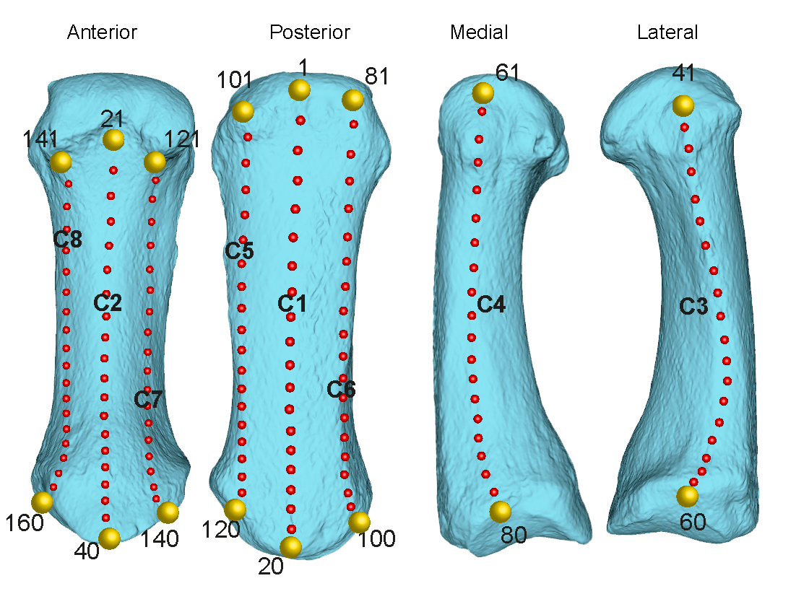

```{r setup, include=FALSE}
knitr::opts_chunk$set(echo = FALSE)
library(rgl)
knitr::knit_hooks$set(webgl = hook_webgl)
```

________


Paper authors: **Jonathan Morley, Ana Bucchi, Carlos Lorenzo, Thomas A. Püschel**
Link to [preprint](https://doi.org/https://doi.org/10.1101/2020.04.30.070326)

>Corresponding author:
Thomas A. Püschel
>Contact:
Email: [thomas.puschelrouliez@anthro.ox.ac.uk](mailto:thomas.puschelrouliez@anthro.ox.ac.uk)
Web: [thomas.puschel.com](https://www.thomaspuschel.com/) 

________

```{r, echo=FALSE}
load('MC1.RData')
load('table2.RData')
```

# Landmark collection
3D landmarks were collected to quantify the MC1’s morphology. Eight curves comprising 20 equidistant landmarks each were placed at pre-defined points on the MC1 (Figure 1). These landmarks were chosen to provide a good representation of the shaft of the bone. The first and last landmarks from each one of the eight curves were treated as fixed (i.e., 16 fixed landmarks), whereas all the rest of them (i.e., 144 landmarks) were considered as semi-landmarks. 




# Landmark and semi-landmark definitions
```{r, echo=FALSE}
dt %>%
  kableExtra::kbl() %>%
  kableExtra::kable_paper() %>%
  kableExtra::row_spec(c(1,18), bold = T) %>%
  kableExtra::scroll_box(width = "500px", height = "200px")
```

# Visualize landmarks and semi-landmarks
The model closest to the mean shape was previously warped to match the multivariate mean using the thin plate spline method. The landmarks and semi-landmarks are plotted on the surface of this average 3D model. The 16 fixed landmarks correspond to the yellow spheres, whereas the 144 semi-landmarks correspond to the smaller red spheres. Please notice that the 3D model was decimated to an extremely small size (as compared to our original models) to avoid long computational times when rendering with `rgl`. 


```{r, webgl=TRUE, echo=FALSE}
rgl.bg(color = "white") # Setup the background color
rgl.spheres(averageshape, r = 0.002, color = "red") 
rgl.spheres(fixedlmks, r = 0.005, color = "gold") 
shade3d(averagemesh,col='#5BBCD6', specular=1)

```

